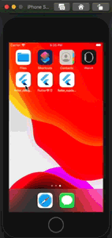
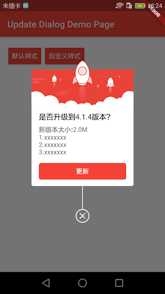

# flutter_dialog_example

Demonstrates how to use the flutter_update_dialog plugin.

## Demonstration



## Screenshot

* Default Style



* Custom Style


## Getting Started

* Check to see if the version number is correct
```
flutter --version
```

* Run the following command to see if additional dependencies need to be installed to complete the installation
```
flutter doctor
```

* Run the startup demo
```
flutter packages get
flutter run
```